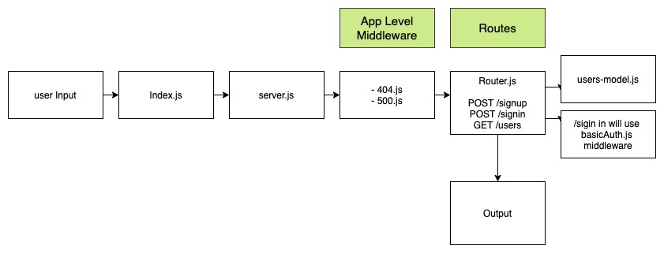

# Auth-server

# LAB - Class 14

### Author: Davee Sok

### Links and Resources

- [ci/cd](https://github.com/davee-401-advanced-javascript/auth-server/actions) (GitHub Actions)
- [Lab 11 Pull Request](https://github.com/davee-401-advanced-javascript/auth-server/pull/1)
- [Lab 12 Pull Request](https://github.com/davee-401-advanced-javascript/auth-server/pull/4)
- [Lab 13 Pull Request](https://github.com/davee-401-advanced-javascript/auth-server/pull/2)
- [Lab 14 Pull Request](https://github.com/davee-401-advanced-javascript/lab14/pull/1)
<!-- - [back-end server url](http://xyz.com) (when applicable)
- [front-end application](http://xyz.com) (when applicable) -->

### Setup

#### `.env` requirements (where applicable)

- Add the following into an .env file:

```
PORT=3000
MONGODB_URI=mongodb://localhost:27017/authenticated-api-server
SECRET= pick a secret word
CLIENT_ID= get this from github
CLIENT_SECRET= get this from github
STATE= pick anything you want
TOKEN_SERVER=https://github.com/login/oauth/access_token
REDIRECT_URI=http://localhost:3000/oauth
REMOTE_API=https://api.github.com/user
```

#### How to initialize/run your application (where applicable)

- Clone repository
- Enter `npm start` or `nodemon index.js` into command line

#### How to use your library (where applicable)

#### Tests

<!-- - How do you run tests?
- Any tests of note?
- Describe any tests that you did not complete, skipped, etc -->

- In the terminal enter `npm test`

#### UML

<!-- Link to an image of the UML for your application and response to events -->


